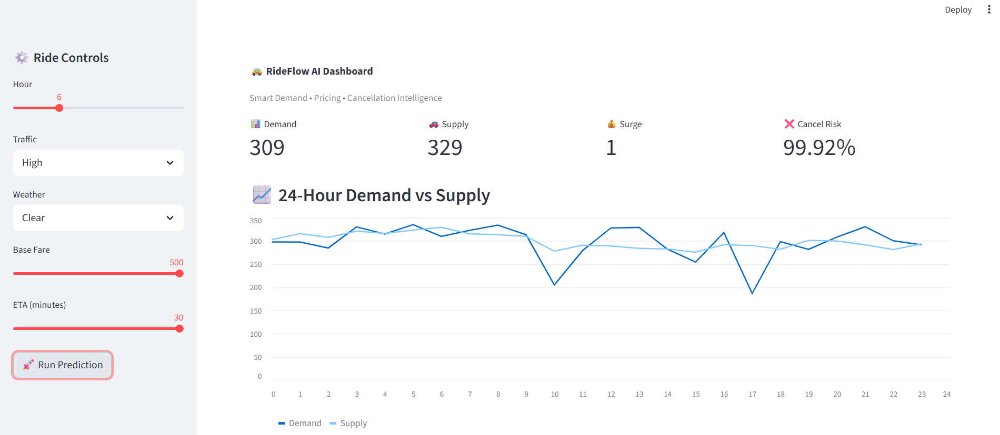

# 🚕 RideFlow AI — Intelligent Ride Optimization Platform

## 📌 Overview

RideFlow AI is an end-to-end machine learning system designed to optimize ride-hailing operations by predicting demand, balancing driver supply, dynamically adjusting pricing, and minimizing ride cancellations.

The project simulates a real-world mobility platform (similar to Uber/Ola) and demonstrates how AI-driven decision systems improve operational efficiency, driver utilization, and customer experience.

---

## 🎯 Problem Statement

Ride-hailing platforms face several real-world challenges:

* Demand–supply imbalance across locations and time
* High ride cancellation rates
* Inefficient surge pricing strategies
* Poor customer and driver experience

This project addresses these challenges using machine learning models integrated into a real-time dashboard.

---

## 🧠 Key Features

### 📊 Ride Demand Prediction

Forecast ride demand based on time patterns.

### 🚗 Driver Supply Prediction

Estimate available drivers dynamically.

### 💰 Dynamic Pricing Engine

Applies surge pricing using demand–supply gap.

### ❌ Cancellation Prediction

Predicts likelihood of ride cancellation.

### 📈 Interactive Dashboard

Streamlit-based UI showing real-time predictions and insights.

---

## 🏗️ System Architecture

```
Data → Preprocessing → ML Models → Business Logic → Streamlit Dashboard
```

Pipeline Flow:

```
Demand → Supply → Pricing → Cancellation → Insights
```

---

## 🛠️ Tech Stack

* Python
* Pandas, NumPy
* Scikit-learn
* Streamlit
* Matplotlib

---

## 📊 Models Used

| Module                  | Model                   |
| ----------------------- | ----------------------- |
| Demand Prediction       | Random Forest Regressor |
| Supply Prediction       | Random Forest Regressor |
| Cancellation Prediction | Logistic Regression     |

---

## 🚀 How to Run Locally

```bash
git clone https://github.com/dhivyapriyaa.r22/RideFlow-AI.git
cd RideFlow-AI

python -m venv venv
venv\Scripts\activate

pip install -r requirements.txt

python -m streamlit run app.py
```

Open:

```
http://localhost:8501
```

---

## 📸 Dashboard Preview



---

## ⚠️ Limitations

* Uses synthetic dataset
* No real-time API integration
* Performance depends on feature engineering

---

## 🔮 Future Improvements

* ETA prediction using LSTM
* Real-time traffic & weather APIs
* Cloud deployment
* Advanced driver matching system

---

## 💡 Key Learnings

* End-to-end ML pipeline design
* Feature engineering for time-series data
* Model deployment in real applications
* Building interactive dashboards

---

## 👨‍💻 Author

**Priyadharshini Ramakrishnan**
📧 [dhivyapriyaa.r@gmail.com](mailto:dhivyapriyaa.r@gmail.com)

---

## ⭐ Support

If you found this project useful, give it a ⭐ on GitHub!
